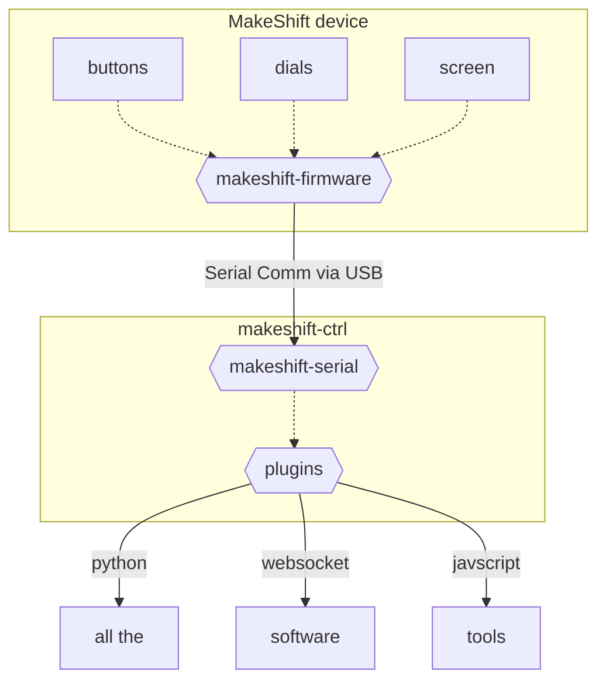

# From the Top

The MakeShift is more than just a fancy desk toy with buttons, it's a macro system that is completely hackable from the hardware all the way up to the interface.

The overarching goal of the project is to drop the distance between keyboard and software. Most professional software tools have built-in plugins or extension systems. The MakeShift is designed to skip the process of setting up keybinds, alt-tabbing, and then hitting keys. Instead, provide direct access to scripts straight from a macro-pad.

This section of the library aims to document how the MakeShift works in a more... participatory manner.

TL;DR - We're going to learn how it works by building the darn thing.

## Breakdown of the Breakdown

There are three-ish big pieces that make up the MakeShift system - hardware, firmware, software. This guide will cover all three in sometimes excruciating detail. For now, we'll go over them in not-so-painful generalities.

### Hardware

MakeShifts are fundamentally input devices - buttons, dials, the whole nine yards. Humans haven't changed too much physically for a few millenia, so the physical sizes and spacing we find comfortable haven't changed either. A good button 200 years ago will feel about as good as one from today. So we picked out some good buttons and designed the rest of the device around them.

The hardware sections will be breaking down the goals of the physical shape of the device with a focus on MakeShift Alpha.

- talk about the motherboard - circuitry, etc
- talk about firmware that recieves and sends signals - esp the working api
- talk about makeshift-serial and makeshift-ctrl upwards to plugins

## System Diagram

The following chart is a short overview of how all the pieces fit together.

## What Makes a MakeShift?

The MakeShift is built around the powerful [Teensy 4.x](https://www.pjrc.com/store/teensy40.html) series microcontroller, allowing very powerful capabilities that (as of writing) we're not even close to exploiting to the fullest yet.

