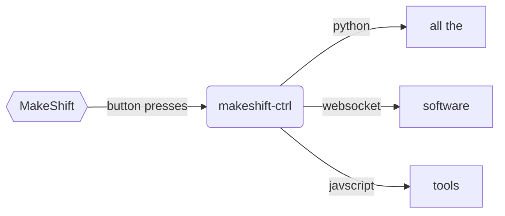

# MakeShift at a Glance

The MakeShift works like a macropad. Each button motion (up or down) and dial movement (clockwise or counterclockwise) has an event that you can hook up whatever actions you'd like to happen.

Instead of keystrokes or sequences keystrokes, the MakeShift has scripts that run when a button is pressed, or a dial is turned.

Fundamentally, the MakeShift is two things working together: the [MakeShift](../shop) device, and the [makeshift-ctrl](../software) software.

The keypad that sits on the desk is responsible only for sending the most basic signals to the computer - i.e. 'button 1 pressed'. It is up to makeshift-ctrl to listen for the signal, and responds to those signals by running the scripts that a user (this could be you!) writes.

## Plugins

Out of the box, makeshift-ctrl doesn't do much beyond looking funny and acknowledging button presses. Plugins are used to allow makeshift-ctrl to talk to other software on the computer. This is so that we can keep the installation (and updates) small and bloat-free.

During alpha, plugins will need to be downloaded and then installed. The exact direction of plugin management is not yet set for beta and beyond. There are a number of security issues that are easiest to address at the design stage and addressing them will shape how makeshift-ctrl handles plugins.

We do have a good idea of priorities:

- Plugins must be easily discoverable, both in terms of finding the right plugin, and figuring out how they work
- The user must be able to easily learn of any security risks as they appear

Some major concerns include:

 - How to verify plugin authors?
 - How to notify users of issues?
 - If there is a compromised plugin, how to roll back versions?
 - How to keep the plugin development process easily accessible despite these requirements?

## Cues

'User written scripts' are a mouthful, so they've been rebranded. During the makeshift-ctrl alpha, users will be able to write cues in javascript. Once makeshift-ctrl hits beta, we'll be working on a drag and drop interface to really simplify the process of creating and testing out cues.
